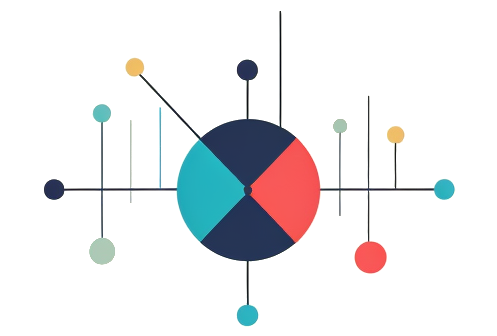

  

<h1 align="center">Workshop on New Measures & Metrics   LAK24</h1>

# Workshop Details 

**Date:**  TBD  
**Time:**  TBD 
**Place:** In-person, Dublin Ireland 

## Overview

Are you investigating a novel educational measure? A new way to count student progress? A radical way to calculate attention? A creative adjustment to a socio-emotional metric? A KPI for classroom activities? The LAK24 Workshop on New Measures & Metrics is the place to be.

The NMME Workshop at LAK24 is bringing together researchers and practitioners to hatch new ideas for educational measures and metrics. The goal is to strengthen the development and utilization of measurment tools from the learning analytics community. 

## Call for Participation

Get involved! The main activity will be the presentation and discussion of particpant-submitted measures and metrics. To take part please [**submit a measure or metric that you are currently working on or want to be working on in the future by December 16th!**](https://tccolumbia.qualtrics.com/jfe/form/SV_6PZRhoxgXkmmaKq)  

**The most promising measure, as voted on by partipants, will recieve a $300 USD incentive award to help move their work forward.**

Registration for attendance is also required via the [LAK 2025 conference webpage](https://www.solaresearch.org/events/lak/lak25/).

## Organizers

Charles Lang, Teachers College Columbia University     
Geraldine Gray, TU Dublin  
Ruth Cobos, 

